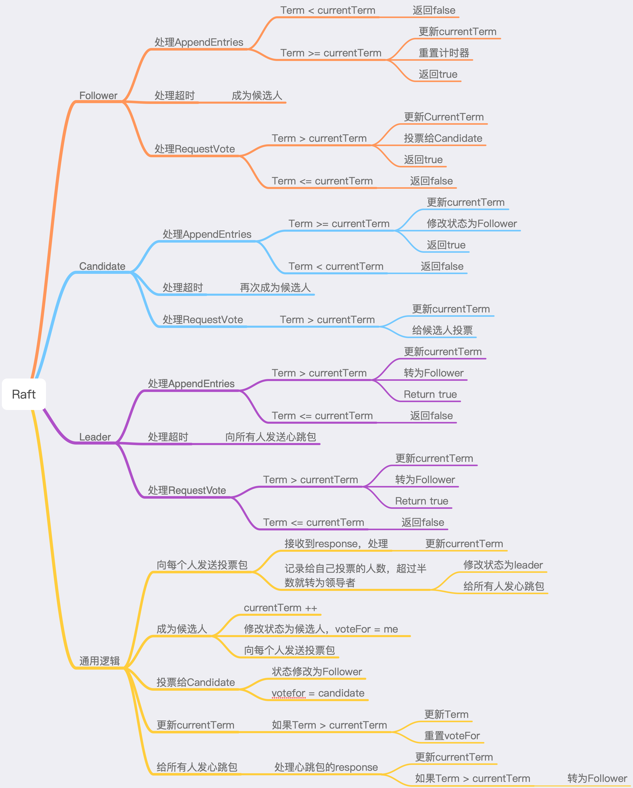

# 6.824 代码仓库

## Lab1

- [x] 通过了所有测试
- [x] 解决中间会有读取空行的问题出现。
  - 单个Worker时，测试程序使用wc，
  - 多个Worker时，使用rtiming，
  - 后者会存在某些中间文件为空，进而产生读取空行的问题。所以这里其实是正常现象，不需要当作错误。
- [ ] Worker写文件时都是写入临时文件中，待写入完毕之后再将临时文件重命名为正确的文件名。
  - 通过这种方式避免Reduce运行过程中读取到中间文件的问题。

## Lab 2a

### 思路

